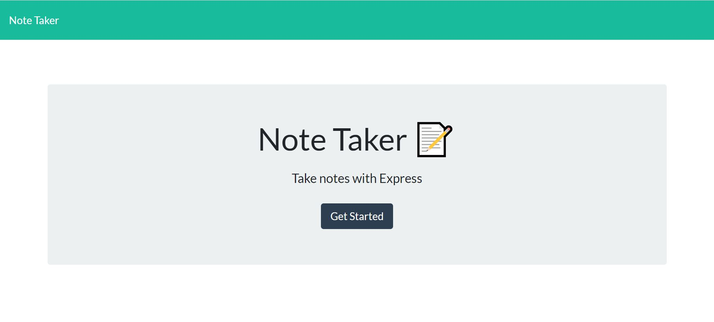
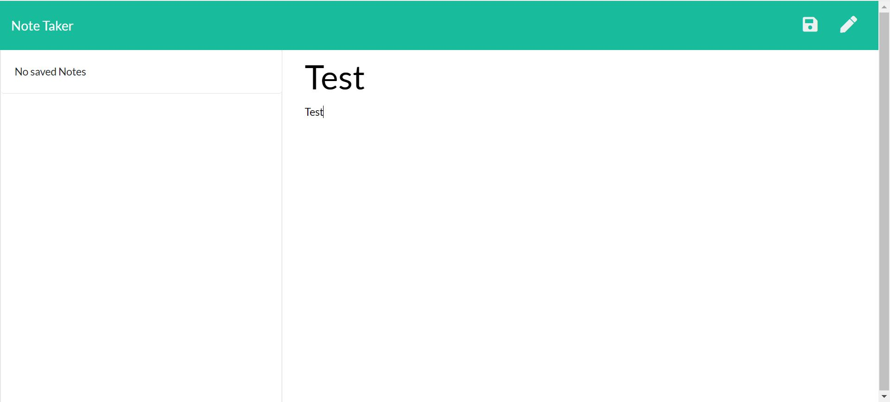
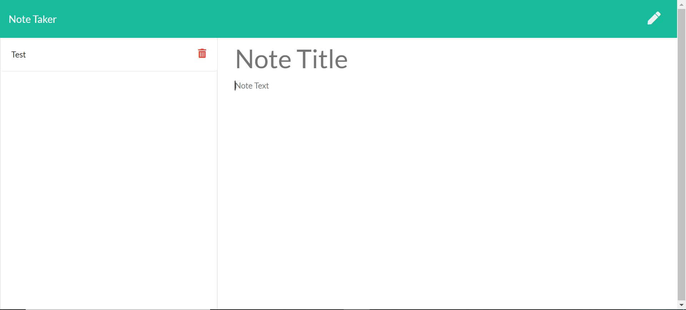

# NoteTaker

## Overview 

This is an application used to write, save, and delete notes. the application uses express as backend and save and retrieve notes to a json file.

## Usage

To use this application, copy the link below to a browser's url and enter:

https://cryptic-sands-13024.herokuapp.com/

## How it works

The app opens up with an intial page and a Get Started button. Once the users click the button, they are taken to the note writing page

Users can specify the note title by clicking on the "Note Title" box, likewise with note text. In order to save a note, note text must have some contents.

To save the note, users can click the save button on the top right corner. Users can also write a new note and discard the current one by clicking the new note button on the right of save button

Save notes are displayed on the left side. To delete the notes, there's a trashbin button on the right side of the notes you want to delete. To view the notes simply click on the notes

## Technologies

HTML, CSS, Javascript, nodejs, express, heroku

## License

MIT
